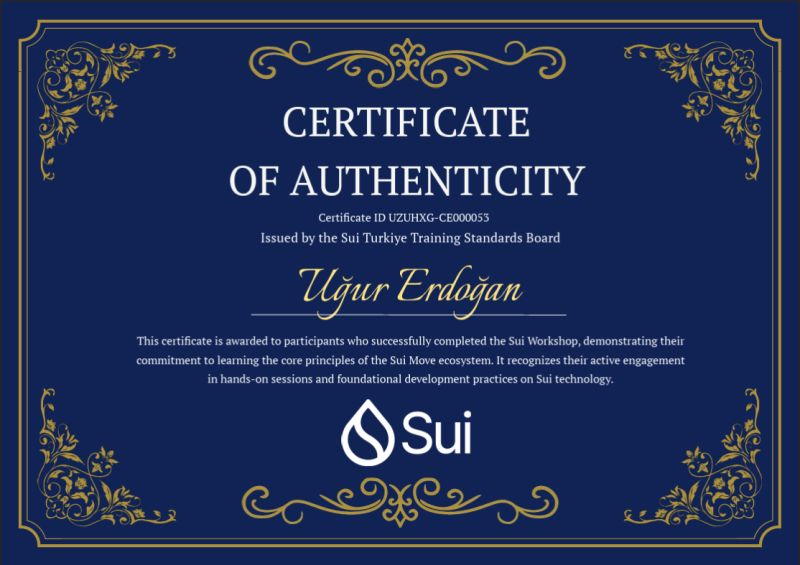
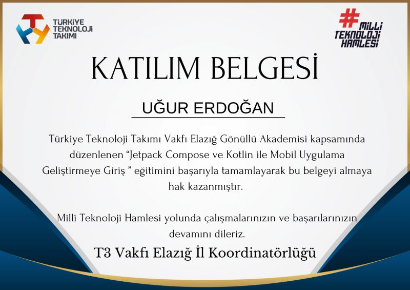
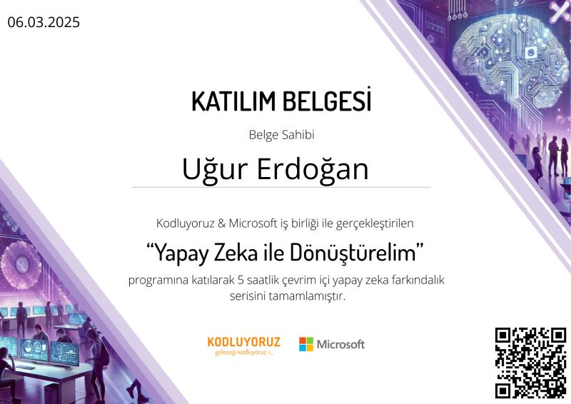
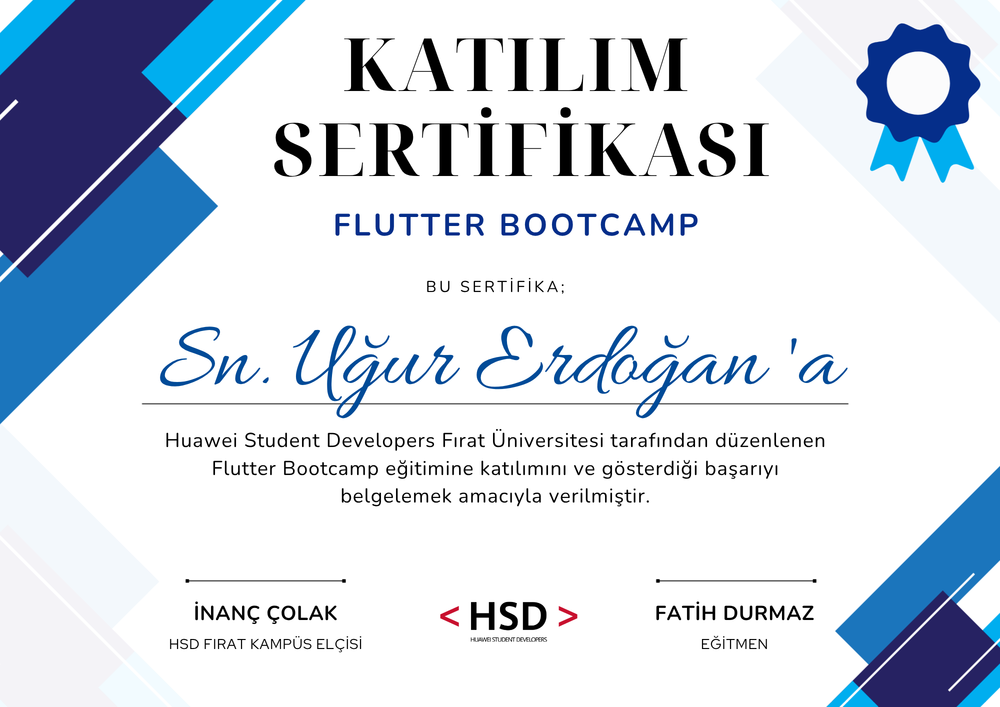

# Merhaba, ben Uğur Erdoğan! 👋

### 👨‍💻 Yazılım Mühendisi Adayı | Fırat Üniversitesi

Geleneksel yazılım disiplinini Web3 şeffaflığı ve modern mobil çözümlerle birleştiren bir Yazılım Mühendisliği öğrencisiyim. Blokzincir tabanlı tedarik zinciri yönetimi ve kullanıcı odaklı mobil uygulamalar üzerine Ar-Ge çalışmaları yürütüyorum. 

---

### 🚀 Nelerle İlgileniyorum?
- **Web3 & Blockchain:** Sui Move ve Solidity ile akıllı kontrat mimarileri geliştiriyorum.
- **Mobile Development:** Flutter ve Kotlin/Jetpack Compose ile modern mobil arayüzler tasarlıyorum.
- **AI & Emerging Tech:** Yapay zeka farkındalık projeleri ve yeni nesil teknoloji entegrasyonları üzerine odaklanıyorum.

---

### 🔬 Akademik Projeler & Web3 Başarıları

#### 🍇 TÜBİTAK 2209-A Projesi
**Başlık:** Coğrafi İşaretli Ürünler İçin Blokzincir Tabanlı Tedarik Zinciri Yönetimi ve Orijinallik Takip Sistemi: Elazığ Öküzgözü Üzümü Örneği
- **Danışman:** Doç. [cite_start]Dr. Feyza Altunbey Özbay [cite: 8]
- [cite_start]**Özet:** Ürünün tarladan sofraya olan yolculuğunu blokzincir üzerinde şeffaf ve güvenilir bir modelle kayıt altına alıyoruz. [cite: 12]

#### 🏗️ Sui Move Workshop Project
- Sui Türkiye eğitimlerini tamamlayarak temel Sui Move ekosistemi ve akıllı kontrat geliştirme prensiplerinde yetkinlik kazandım.
- **Proje Detayı:** Akıllı kontrat ve React frontend entegrasyonuna sahip merkeziyetsiz bir uygulama geliştirildi.

---

### 📜 Sertifikalarım

  
  
  
  

* **Sui Türkiye**: Certificate of Authenticity - Sui Move Workshop
* **Huawei Student Developers**: Flutter Bootcamp Katılım Sertifikası
* **T3 Vakfı**: Jetpack Compose ve Kotlin ile Mobil Uygulama Geliştirme
* **Kodluyoruz & Microsoft**: Yapay Zeka ile Dönüştürelim Farkındalık Programı

---

### 🛠️ Yetkinliklerim

---

### 📊 GitHub İstatistiklerim

---

### 📫 Bana Ulaşın
[LinkedIn](https://tr.linkedin.com/in/u%C4%9Fur-erdo%C4%9Fan-742590304) | [Twitter (X)](https://twitter.com/ugurdotsui)
