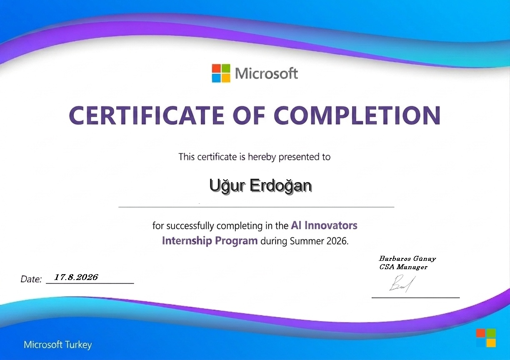
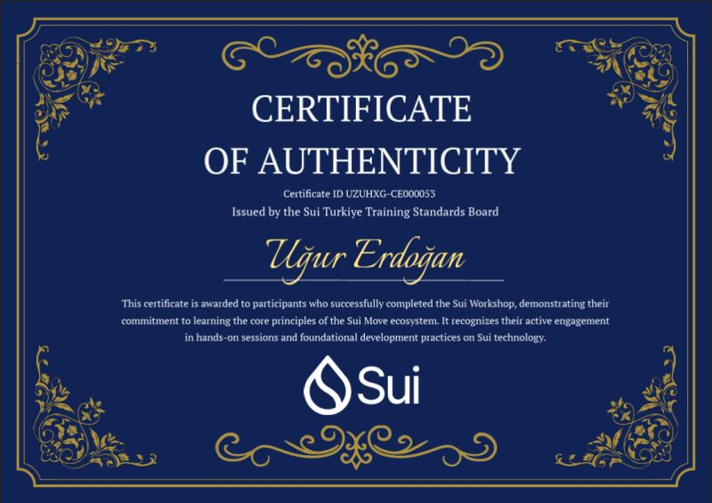
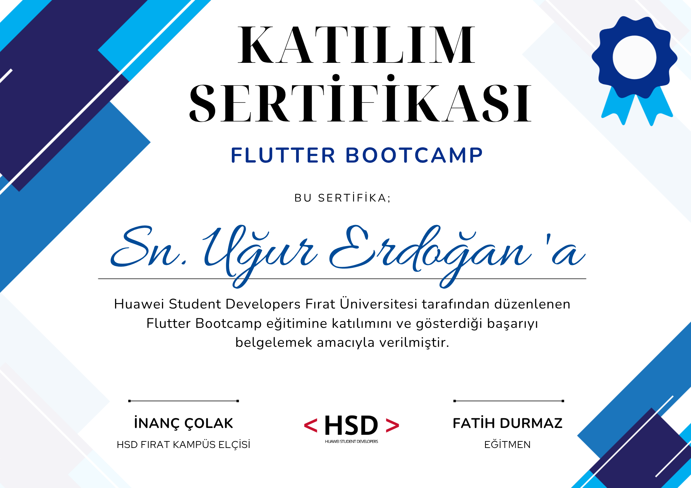
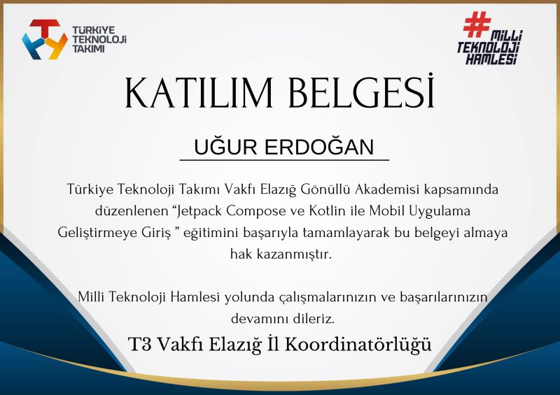
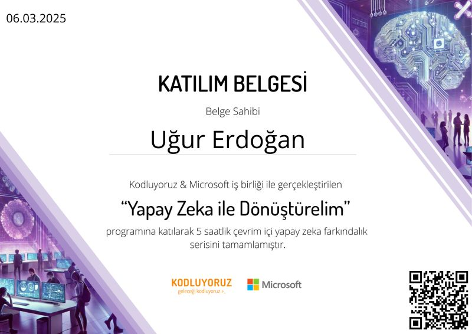
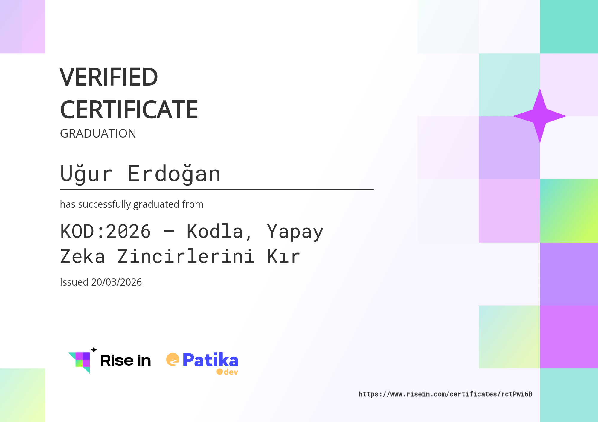
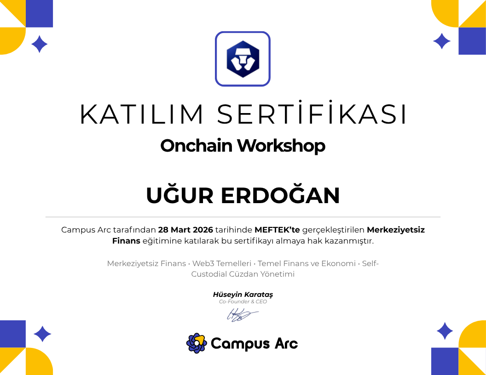

# Merhaba, ben Uğur Erdoğan! 👋

### 👨‍💻 Yazılım Mühendisi Adayı | AI, Web3 & Mobil Geliştirme

Fırat Üniversitesi Yazılım Mühendisliği 3. sınıf öğrencisiyim. Yapay zeka, Web3 ve mobil teknolojilerle uçtan uca uygulamalar geliştiriyorum. Özellikle yerel çalışan dil modelleri, belge tabanlı soru-cevap sistemleri (RAG), akıllı kontratlar ve backend mimarileri üzerine çalışıyorum.

2026 yazında **Microsoft AI Innovators Internship Program**'ı tamamladım. Program kapsamında, belgeleri cihazdan çıkarmadan işleyen **[Local RAG with Microsoft Foundry Local](https://github.com/uguredgf/local-rag-foundry)** projesini geliştirdim. Şu anda **Thyris.ai'da Product Intern** olarak AI odaklı ürün çalışmalarına katkıda bulunuyorum.

---

### 🚀 Nelerle İlgileniyorum?
- **AI & RAG:** LLM entegrasyonu, yerel modeller, hibrit arama, AI agent'ları ve model fine-tuning çalışmaları.
- **Backend & Cloud:** ASP.NET Core, Entity Framework Core, SQL Server, JWT ve Azure ile uygulama geliştirme.
- **Web3 & Blockchain:** Stellar/Soroban, Sui Move ve Solidity ile akıllı kontratlar ve merkeziyetsiz uygulamalar.
- **Mobil Geliştirme:** Flutter ve Kotlin/Jetpack Compose ile kullanıcı odaklı mobil arayüzler.

---

### 💼 Deneyim & Topluluk

- **Thyris.ai | Product Intern** · Eylül 2026 - Devam ediyor  
  AI odaklı ürün ekibinin çalışmalarına katkıda bulunuyorum.
- **BilgiYön Yazılım Danışmanlık | Yazılım Mühendisliği Stajyeri** · Ağustos - Eylül 2026  
  Varlık ve bakım takibi için **Veritas** uygulamasını geliştirdim. ASP.NET Core, Entity Framework Core ve SQL Server ile Onion Architecture kullandım; rol tabanlı yetkilendirme ve JWT kimlik doğrulaması ekleyerek uygulamayı Azure'a dağıttım.
- **Microsoft | AI Innovators Internship Program** · Haziran - Ağustos 2026  
  LLM ve kurumsal yapay zeka uygulamalarına odaklanan yaz programını Local RAG projemle tamamladım.
- **Fırat Blockchain Society | Sponsorluk Birim Lideri** · 2025 - Devam ediyor  
  Topluluk bütçe planlaması, teknoloji şirketleriyle sponsorluk görüşmeleri ve etkinlik iletişiminde görev alıyorum.

---

### 🚀 Öne Çıkan Projeler

#### 🧠 [Local RAG with Microsoft Foundry Local](https://github.com/uguredgf/local-rag-foundry)
**Microsoft AI Innovators yaz programı kapsamında geliştirdiğim yerel belge asistanı.**

- PDF, TXT ve Markdown belgelerini indeksleyerek dosya ve sayfa referanslarıyla Türkçe yanıtlar üretir.
- Microsoft Foundry Local üzerinde **Phi-4 Mini** ve **Qwen3 Embedding** kullanır; verileri **SQLite** üzerinde saklar.
- Vektör benzerliği, **BM25** ve yeniden sıralamayı birleştiren hibrit arama sunar.
- **Streamlit** arayüzü ve komut satırı desteği içerir. İlk model indirmesinden sonra belge işleme ve yanıt üretimi yerel olarak, internet bağlantısı olmadan çalışabilir.

#### 🛡️ ShieldPay · Stellar / Soroban
Sıfır bilgi ispatları (Groth16), Poseidon hashing ve Merkle root/nullifier yapısıyla gizliliği koruyan bir bordro sistemi tasarladım. React arayüzünde işveren, çalışan ve uyum panelleri geliştirdim.

#### 🌱 SustainFund · Stellar / Soroban
KOD:2026 Hackathon için şeffaf bir sağlık bağış uygulaması geliştirdim. Rust/Soroban akıllı kontratını Next.js/TypeScript arayüzü ve Freighter Wallet ile birleştirdim.

#### 📱 SmartVest · Kotlin / Jetpack Compose
Yuvarlama yoluyla mikro yatırım fikrine dayanan, MVVM mimarisiyle geliştirdiğim native Android UI/UX prototipi. Garanti BBVA “Genç Fikrinle Parla” programı için hazırlandı.

#### 💬 Türkçe Duygu Analizi · PyTorch / Hugging Face
Bir hackathon projesinde XLM-RoBERTa modelini Türkçe duygu sınıflandırması için fine-tune ettim; veri hazırlama, tokenizasyon ve model değerlendirme adımlarını uyguladım.

#### 🏗️ Sui Move Workshop Project
- Sui Türkiye eğitimlerini tamamlayarak temel Sui Move ekosistemi ve akıllı kontrat geliştirme prensiplerinde yetkinlik kazandım.
- **Proje Detayı:** Akıllı kontrat ve React frontend entegrasyonuna sahip merkeziyetsiz bir uygulama geliştirildi.

---

### 📜 Sertifikalarım

#### Microsoft AI Innovators Internship Program · Yaz 2026
Programı başarıyla tamamladım; bitirme sertifikam **17 Ağustos 2026** tarihinde düzenlendi.

  

#### Diğer Eğitimler & Sertifikalar

  
  
  
  
  
  

* **🛡️ [Cyfrin Updraft: Blockchain Basics](https://profiles.cyfrin.io/u/ugurtlf/achievements/blockchain-basics)** (Dijital Doğrulanmış Başarı)
* **Sui Türkiye**: Certificate of Authenticity - Sui Move Workshop
* **Huawei Student Developers**: Flutter Bootcamp Katılım Sertifikası
* **T3 Vakfı**: Jetpack Compose ve Kotlin ile Mobil Uygulama Geliştirme
* **Kodluyoruz & Microsoft**: Yapay Zeka ile Dönüştürelim Farkındalık Programı
* **Rise İn**: KOD:2026 – Kodla, Yapay Zeka Zincirlerini Kır
* **Campus Arc**: Onchain Workshop - Merkeziyetsiz Finans Eğitimi

---

### 🛠️ Yetkinliklerim
| Alan | Teknolojiler & Araçlar |
| --- | --- |
| Yapay zeka | Python, Microsoft Foundry Local, RAG, LLM entegrasyonu, Hugging Face, PyTorch, Streamlit |
| Backend & bulut | ASP.NET Core, Entity Framework Core, SQL Server, SQLite, JWT, Swagger, Azure |
| Web3 | Stellar / Soroban, Rust, Solidity, Sui Move |
| Web & mobil | React, Next.js, TypeScript, Flutter, Kotlin, Jetpack Compose |
| Geliştirme süreçleri | Git, GitHub, API testleri, DevOps, AI destekli geliştirme |

---

### 📊 GitHub İstatistiklerim

---

### 📫 Bana Ulaşın
[LinkedIn](https://www.linkedin.com/in/ugur-erdogan-tr) | [E-posta](mailto:ugurtlf23@gmail.com) | [Twitter (X)](https://twitter.com/ugurdotsui) | [Cyfrin Profile](https://profiles.cyfrin.io/u/ugurtlf)
