
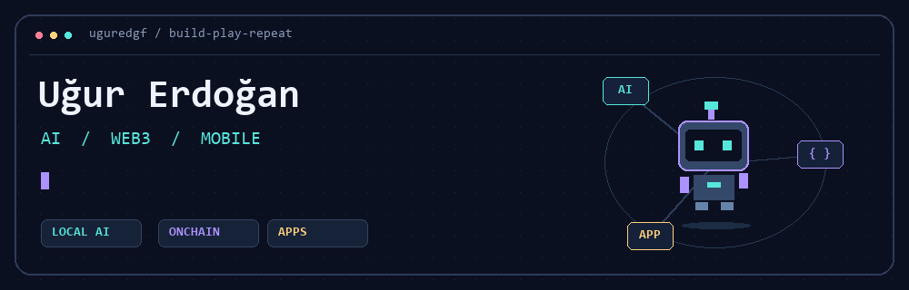

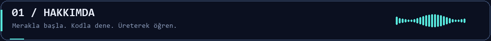

Merhaba, ben <b>Uğur</b> 👋 Fırat Üniversitesi Yazılım Mühendisliği 3. sınıf öğrencisiyim. Yerel yapay zeka, Web3 ve mobil teknolojilerle uçtan uca uygulamalar geliştiriyorum.

<table><tr>
<td width="50%" valign="top"><b>🟢 Şu anda</b>  Thyris.ai'da <b>Product Intern</b> olarak AI odaklı ürün çalışmalarına katkıda bulunuyorum.</td>
<td width="50%" valign="top"><b>🏁 Son öğrenme durağım</b>  <b>Microsoft AI Innovators · Yaz 2026</b> Programı Local RAG projemle tamamladım.</td>
</tr></table>

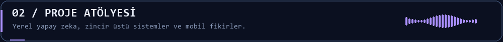

<table>
<tr>
<td width="50%" valign="top">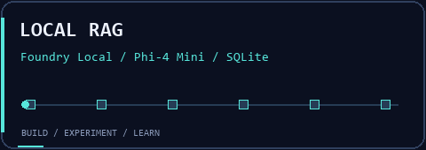
Microsoft AI Innovators kapsamında geliştirdiğim yerel belge asistanı. PDF, TXT ve Markdown belgelerinde hibrit arama yapar; dosya ve sayfa referanslarıyla Türkçe yanıtlar üretir. İlk model indirmesinden sonra çevrimdışı çalışabilir.  <a href="https://github.com/uguredgf/local-rag-foundry"><b>Kaynak kodunu keşfet ↗</b></a>
</td>
<td width="50%" valign="top">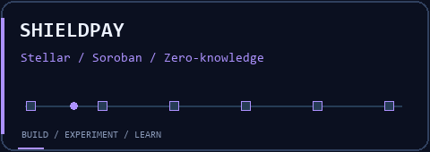
Groth16, Poseidon ve Merkle root/nullifier yapısıyla gizliliği koruyan bordro sistemi. React arayüzünde işveren, çalışan ve uyum panelleri geliştirdim.
</td>
</tr>
<tr>
<td width="50%" valign="top">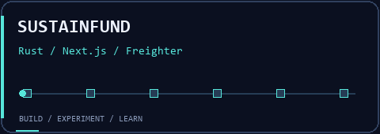
KOD:2026 Hackathon için geliştirdiğim şeffaf sağlık bağış uygulaması. Rust/Soroban akıllı kontratı, Next.js arayüzü ve Freighter Wallet entegrasyonu.
</td>
<td width="50%" valign="top">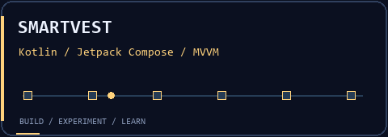
Yuvarlama yoluyla mikro yatırım fikrini native Android UI/UX prototipine dönüştürdüm. Garanti BBVA “Genç Fikrinle Parla” programı için hazırlandı.
</td>
</tr>
<tr>
<td width="50%" valign="top">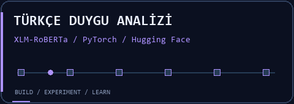
Hackathon projesinde XLM-RoBERTa modelini Türkçe duygu sınıflandırması için fine-tune ettim; veri hazırlama, tokenizasyon ve değerlendirme adımlarını uyguladım.
</td>
<td width="50%" valign="top">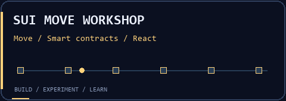
Sui Türkiye eğitimleri kapsamında akıllı kontrat ve React arayüzünü birleştiren merkeziyetsiz uygulama geliştirdim.
</td>
</tr>
</table>

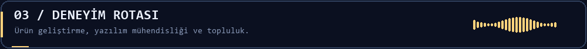

<table>
<tr><td>🟢</td><td><b>Thyris.ai · Product Intern</b> Eylül 2026 – Devam ediyor</td><td>AI odaklı ürün ekibinin çalışmalarına katkı.</td></tr>
<tr><td>🔷</td><td><b>BilgiYön · Yazılım Mühendisliği Stajyeri</b> Ağustos – Eylül 2026</td><td>Veritas varlık ve bakım takip sistemi: ASP.NET Core, EF Core, SQL Server, Onion Architecture, JWT ve Azure dağıtımı.</td></tr>
<tr><td>🟣</td><td><b>Microsoft · AI Innovators Internship Program</b> Haziran – Ağustos 2026</td><td>LLM ve kurumsal AI odaklı yaz programı; Local RAG projesiyle tamamlandı.</td></tr>
<tr><td>🟡</td><td><b>Fırat Blockchain Society · Sponsorluk Birim Lideri</b> 2025 – Devam ediyor</td><td>Bütçe planlaması, teknoloji şirketleriyle sponsorluk görüşmeleri ve etkinlik iletişimi.</td></tr>
</table>

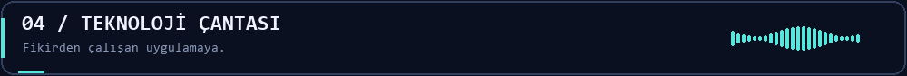

<table>
<tr><td width="50%"><b>🧠 AI & RAG</b>
Python · Foundry Local · Hugging Face · PyTorch · Streamlit · LLM entegrasyonu
</td><td width="50%"><b>⚙️ Backend & Cloud</b>
ASP.NET Core · EF Core · SQL Server · SQLite · JWT · Swagger · Azure
</td></tr>
<tr><td><b>⛓️ Web3</b>
Stellar / Soroban · Rust · Solidity · Sui Move
</td><td><b>📱 Web & Mobil</b>
React · Next.js · TypeScript · Flutter · Kotlin · Jetpack Compose
</td></tr>
</table>

<code>Git</code> &nbsp; <code>GitHub</code> &nbsp; <code>API testleri</code> &nbsp; <code>DevOps</code> &nbsp; <code>AI destekli geliştirme</code>

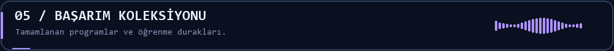

Tam boy görüntülemek için sertifikaya tıkla.

<table>
<tr>
<td width="25%" align="center" valign="top"> <b>Microsoft AI Innovators</b> Yaz 2026 · 17 Ağustos 2026</td>
<td width="25%" align="center" valign="top"> <b>Sui Move Workshop</b> Sui Türkiye</td>
<td width="25%" align="center" valign="top"> <b>Flutter Bootcamp</b> Huawei Student Developers</td>
<td width="25%" align="center" valign="top"> <b>Kotlin & Jetpack Compose</b> T3 Vakfı</td>
</tr>
<tr>
<td width="25%" align="center" valign="top"> <b>Yapay Zeka ile Dönüştürelim</b> Kodluyoruz & Microsoft</td>
<td width="25%" align="center" valign="top"> <b>KOD:2026</b> Rise In</td>
<td width="25%" align="center" valign="top"> <b>Onchain Workshop</b> Campus Arc</td>
<td width="25%" align="center"><b>⛓️ Blockchain Basics</b> Cyfrin Updraft  <a href="https://profiles.cyfrin.io/u/ugurtlf/achievements/blockchain-basics">Doğrulanmış başarı ↗</a></td>
</tr>
</table>

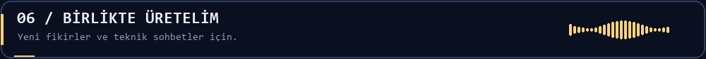

<b>Bir fikrin mi var? Konuşalım.</b>

<a href="https://www.linkedin.com/in/ugur-erdogan-tr">LinkedIn ↗</a> &nbsp; · &nbsp; <a href="mailto:ugurtlf23@gmail.com">E-posta ↗</a> &nbsp; · &nbsp; <a href="https://twitter.com/ugurdotsui">X ↗</a> &nbsp; · &nbsp; <a href="https://profiles.cyfrin.io/u/ugurtlf">Cyfrin ↗</a>

Merak et. Deney yap. Paylaş. Tekrarla.

